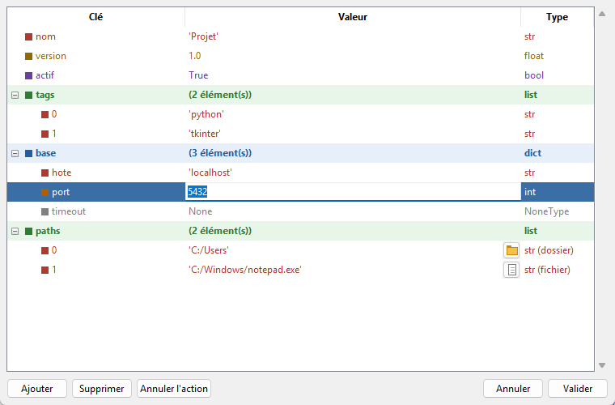

# frame_dict — éditeur graphique d'objets Python

Petit éditeur **tkinter** pour consulter et modifier des variables Python (`dict`, `list` imbriqués…, `xarray.Dataset`) dans une arborescence, directement depuis un script ou à partir d'un fichier JSON ou NetCDF.

Un seul fichier. Pour les `dict`, aucune dépendance externe : uniquement la bibliothèque standard. Les `xarray.Dataset` nécessitent `xarray` (avec `numpy` et `pandas`).



## Fonctionnalités

- **Arborescence colorée** : une couleur par type (`str`, `int`, `float`, `bool`, `None`…), et un fond distinct en gras pour les conteneurs `dict` et `list`.
- **Édition en place** : double-clic sur une cellule pour modifier une **valeur** ou renommer une **clé** directement dans l'arbre, sans boîte de dialogue.
- **Navigation au clavier** entre les cellules (`Tab`, flèches), pour enchaîner les modifications.
- **Chemins de fichiers** : les chaînes qui ressemblent à un chemin (`C:/Users`, `./config`, `~/data.csv`…) sont détectées et reçoivent un bouton pour choisir un dossier ou un fichier.
- **Annulation** des modifications (`Ctrl+Z`, jusqu'à 50 actions).
- **Lecture / écriture JSON**, et **NetCDF** pour les `xarray.Dataset`.
- **Objets xarray** : coordonnées, variables et attributs d'un `xarray.Dataset` (voir [plus bas](#objets-xarray)).
- **L'objet d'origine n'est jamais modifié** : l'éditeur travaille sur une copie et ne renvoie le résultat qu'après validation.
- **Architecture extensible** : un nouveau type d'objet se prend en charge en écrivant un *adaptateur*, sans toucher à l'interface.

## Prérequis

- Python 3.9 ou plus récent (développé et testé avec Python 3.12).
- tkinter, fourni avec Python sur Windows et macOS. Sous Linux, il peut falloir l'installer à part (ex. `sudo apt install python3-tk`).

## Utilisation

### Depuis la ligne de commande

```bash
# Ouvre un exemple intégré
python frame_objet_Adapter.py

# Ouvre un fichier JSON (qui doit contenir un objet au premier niveau)
python frame_objet_Adapter.py config.json

# Ouvre un fichier NetCDF (.nc, .nc4, .cdf) comme xarray.Dataset
python frame_objet_Adapter.py donnees.nc

# Ouvre un xarray.Dataset d'exemple
python frame_objet_Adapter.py --xarray
```

À la fermeture, l'objet validé est affiché dans la console (au format JSON pour un `dict`), ou `Annulé.`.

### Depuis un script Python

```python
from frame_objet_Adapter import edit_object

config = {
    "nom": "Projet",
    "base": {"hote": "localhost", "port": 5432},
    "dossier_sortie": "C:/Users/moi/Documents",
}

resultat = edit_object(config, title="Configuration")
if resultat is None:
    print("Modifications annulées")
else:
    config = resultat
```

`edit_object` ouvre la fenêtre, attend sa fermeture puis retourne une **copie modifiée** de l'objet, ou `None` si l'utilisateur annule.

## Saisie des valeurs

Le texte saisi est interprété comme un littéral Python (`ast.literal_eval`) :

| Saisie | Valeur obtenue |
|---|---|
| `42` | `int` |
| `3.5` | `float` |
| `True` / `False` | `bool` |
| `None` | `None` |
| `[1, 2]`, `{"a": 1}` | `list`, `dict` |
| `'texte'` | `str` |
| `texte` (sans guillemets) | `str` (repli si le texte n'est pas un littéral valide) |

Pour forcer une chaîne qui ressemble à un nombre, il faut l'entourer de guillemets : `'42'`.

Pour les **clés**, une clé `str` reste une `str` : le texte est pris tel quel, sans guillemets. Une clé d'un autre type (`int`, `tuple`…) est interprétée comme ci-dessus. Le renommage conserve l'ordre des clés.

## Objets xarray

Un `xarray.Dataset` s'édite comme un `dict` : `edit_object(ds)` retourne une copie modifiée, ou `None`.

```
Dimensions        time: 4, station: 3, niveau: 2        (lecture seule)
Coordonnées
  time            (time: 4) | 2024-01-01 00:00:00, …
    attrs
    [0]           2024-01-01 00:00:00
Variables
  debit           (time: 4) | 1.2, 3.4, 2.2, 0.9        variable à 1 dimension
    attrs
    [0]  time = 2024-01-01 00:00:00    1.2
  temperature     (time: 4, station: 3) | 12.4, …       variable à 2 dimensions
    [0]  time = 2024-01-01 00:00:00    12.4, 11.6, 13.9   une ligne par indice…
      [0]  station = 'Tours'           12.4               …une cellule par colonne
  cube            (time: 4, station: 3, niveau: 2) | …  3 dimensions ou plus : résumé seul
  seuil           15.0                                  0 dimension : éditable sur la ligne
Attributs
```

- Un Dataset peut contenir un nombre quelconque de variables. Les variables à **1 ou 2 dimensions** sont détaillées valeur par valeur ; celles à **3 dimensions ou plus** sont affichées sous la forme `nom (dim1: n1, dim2: n2, …) | valeurs…`, sans édition des valeurs.
- Quand une dimension possède une coordonnée, sa valeur est rappelée devant chaque indice (`[0]  time = 2024-01-01`).
- **Valeurs** : la saisie est convertie dans le type du tableau. Les dates se saisissent comme du texte (`2024-01-31`, `2024-01-31 12:00`), `nan` et `None` donnent `NaN` dans un tableau de réels. Un réel saisi dans un tableau d'entiers, ou une chaîne plus longue que les autres, élargit le type du tableau au lieu de tronquer la valeur. Modifier une coordonnée de dimension met à jour son index.
- **Renommer** une variable (double-clic ou `F2` sur son nom). Renommer une coordonnée de dimension renomme aussi la dimension.
- **Ajouter** une variable : sélectionner *Coordonnées* ou *Variables*, puis saisir un nom et une valeur : un scalaire (`3.5`) ou un tuple `(dimensions, données)`, ex. `('time', [1, 2, 3, 4])` ou `(('time', 'station'), [[…], …])`.
- **Supprimer** une variable ou un attribut avec `Suppr`. La taille des tableaux ne peut pas être modifiée.
- Les **attributs** (globaux et de chaque variable) s'éditent comme un `dict`.
- Pour garder l'affichage réactif, seules les 50 premières lignes et les 20 premières colonnes d'un tableau sont affichées (`DatasetAdapter.MAX_ROWS`, `MAX_COLUMNS`). Une ligne `…` indique le nombre d'éléments masqués.
- La lecture charge tout le fichier en mémoire. L'écriture utilise `Dataset.to_netcdf` : il faut `netCDF4`, `h5netcdf` ou `scipy` (NetCDF3 uniquement).

Un `xarray.DataArray` peut être édité via `edit_object(da.to_dataset())`.

## Raccourcis

**Dans l'arbre**

| Touche / action | Effet |
|---|---|
| Double-clic sur la colonne *Clé* | Renommer la clé |
| Double-clic sur la colonne *Valeur* | Modifier la valeur |
| `Entrée` | Modifier la valeur de la ligne sélectionnée |
| `F2` | Renommer la clé de la ligne sélectionnée |
| `Tab` / `Maj+Tab` | Ouvrir la première / dernière cellule éditable de la ligne |
| `Suppr` | Supprimer l'élément sélectionné |

**Pendant la saisie**

| Touche | Effet |
|---|---|
| `Entrée` | Valider |
| `Échap` | Annuler la saisie |
| `Tab` / `Maj+Tab` | Valider et passer à la cellule suivante / précédente |
| `↓` / `↑` | Valider et passer à la même colonne, ligne suivante / précédente |

**Partout**

| Raccourci | Effet |
|---|---|
| `Ctrl+Z` | Annuler la dernière modification |
| `Ctrl+O` | Ouvrir un fichier (JSON, NetCDF) |
| `Ctrl+S` | Enregistrer sous… |

Les valeurs `dict` et `list` ne sont pas éditables directement : on modifie leurs éléments, ou on utilise les boutons *Ajouter* / *Supprimer*.

## Détection des chemins

Une chaîne est considérée comme un chemin si :

- elle désigne un dossier ou un fichier **existant** et contient un séparateur (`/` ou `\`) ; ou
- elle **commence comme un chemin** : `C:\`, `C:/`, `\\serveur`, `/`, `~`, `./`, `../`.

Un chemin existant est classé d'après le disque. Pour un chemin qui n'existe pas encore, une extension indique un fichier et l'absence d'extension un dossier. La colonne *Type* affiche alors `str (dossier)` ou `str (fichier)`.

Le bouton situé à droite de la valeur ouvre `askdirectory` ou `askopenfilename`, positionné sur l'emplacement actuel. Le style de séparateur d'origine (`\` ou `/`) est conservé.

## Architecture

```
Node             description neutre d'une ligne de l'arbre (sans dépendance tkinter)
ObjectAdapter    contrat entre un type d'objet et l'éditeur
DictAdapter      implémentation pour dict (avec dict / list imbriqués)
DatasetAdapter   implémentation pour xarray.Dataset (si xarray est installé)
AdapterRegistry  choisit l'adaptateur selon le type de l'objet
ObjectEditorApp  fenêtre tkinter, indépendante du type édité
```

L'interface ne manipule jamais l'objet directement : elle demande à l'adaptateur la liste des nœuds (`children`) et lui délègue toutes les modifications (`set_value`, `rename_key`, `add_item`, `delete_item`).

### Ajouter un nouveau type d'objet

Il suffit d'écrire un adaptateur et de l'enregistrer. Le dernier adaptateur enregistré qui accepte l'objet est utilisé.

```python
from frame_objet_Adapter import ObjectAdapter, Node, registry, edit_object


@registry.register
class MonAdapter(ObjectAdapter):
    file_types = [("Mon format", "*.ext"), ("Tous les fichiers", "*.*")]

    @classmethod
    def supports(cls, obj):
        return isinstance(obj, MonType)

    def children(self, obj, path):
        """Retourne la liste des Node enfants du nœud situé à `path`."""
        ...

    def set_value(self, obj, path, raw):
        """Modifie en place la valeur située à `path` à partir du texte saisi."""
        ...

    # Facultatif : can_add, requires_key, add_hint, add_item, delete_item,
    #              rename_key, read, write, expand_depth


edit_object(mon_objet)
```

Les champs de `Node` pilotent l'affichage et les possibilités d'édition :

| Champ | Rôle |
|---|---|
| `path` | Chemin d'accès à l'élément, ex. `("base", "port")` |
| `label` | Texte de la colonne *Clé* |
| `display` | Texte de la colonne *Valeur* |
| `type_name` | Nom du type (sert aussi à choisir la couleur) |
| `edit_text` | Texte proposé à l'édition de la valeur |
| `is_container` | Le nœud a-t-il des enfants ? |
| `editable` | La valeur est-elle modifiable ? |
| `renamable` | La clé est-elle modifiable ? |
| `key_edit_text` | Texte proposé au renommage de la clé |
| `path_kind` | `"dir"`, `"file"` ou `None` : affiche le bouton de choix de chemin |
| `type_label` | Texte de la colonne *Type*, s'il diffère de `type_name` (ex. `float64`) |

Les opérations modifient l'objet en place. Pour un type qui ne le permet pas, `set_value`, `rename_key`, `add_item` et `delete_item` peuvent retourner `NewRoot(nouvel_objet, chemin_à_sélectionner)` : l'éditeur remplace alors l'objet (l'annulation reste possible).

L'extension d'un fichier ouvert (`Ctrl+O` ou ligne de commande) choisit l'adaptateur qui le lit, d'après les motifs de `file_types`.

### Personnaliser les couleurs

Les couleurs sont des attributs de classe d'`ObjectEditorApp` : `TYPE_COLORS`, `CONTAINER_BACKGROUNDS`, `SELECTION_BACKGROUND`… On peut les modifier dans une sous-classe :

```python
from frame_objet_Adapter import ObjectEditorApp


class MonEditeur(ObjectEditorApp):
    TYPE_COLORS = {**ObjectEditorApp.TYPE_COLORS, "str": "#006400", "ndarray": "#8b008b"}


app = MonEditeur({"a": 1, "b": "texte"}, title="Éditeur personnalisé")
app.mainloop()
print(app.result)  # None si annulé
```

## Limites connues

- Les fichiers JSON doivent contenir un objet (`dict`) au premier niveau. Les clés non textuelles sont converties en chaînes par `json.dump`.
- Un `ttk.Treeview` colore des lignes entières, pas des cellules : la couleur d'un type s'applique à toute la ligne.
- La détection des chemins interroge le disque à chaque rafraîchissement, ce qui peut ralentir l'affichage avec des chemins réseau lents.
- Un chemin inexistant et sans extension est toujours traité comme un dossier.

## Licence

Distribué sous licence MIT. Voir le fichier [LICENSE](LICENSE).
